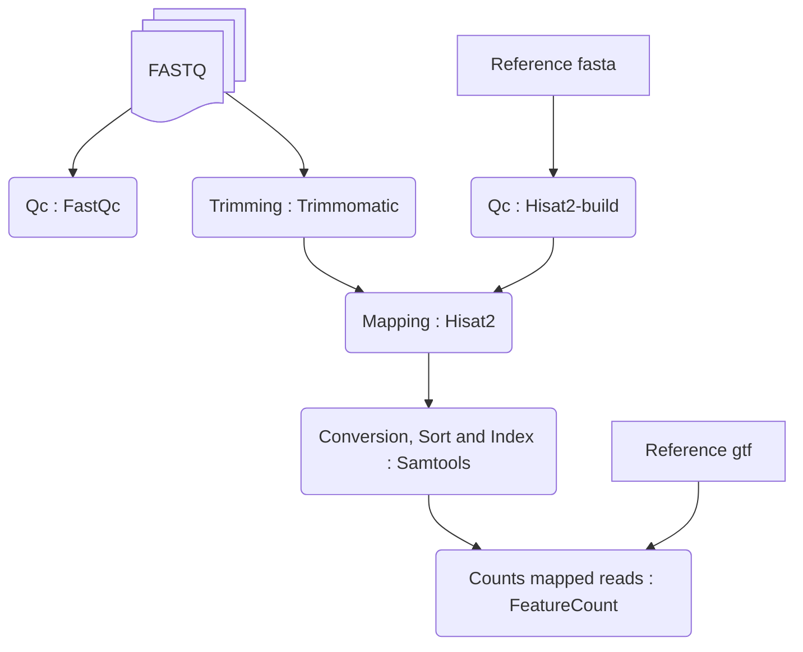

## Bulk RNA pre-processing

In this section you'll be able to perform the preprocessing of the FASTQ files produced for the CRISPR KO.\
For the preprocessing we made a sh script that can be found [here](/01_BulkRNA_preprocessing/02_Script/script_RNA_preprocess_GIT.sh).\
Briefly this script allow to automatically detect number of samples and their names based on FASTQ files and perform all the necessary step until featurecount.




### Prerequisites

#### Clone Github

Use your favorite method to clone this repository in a chosen folder. This will create a "BEX" folder with all the source code.
You must set an environment variable called WORKING_DIR with a value set to the path to this BEX folder. For instance, if I clone the Git repository in "/home/nozais/workspace", then the WORKING_DIR variable will be set to :

```bash

export WORKING_DIR=/home/nozais/workspace/BEX

```

#### Reference genome

```bash
#Download the reference genome folder used to the reference folder
wget -P $WORKING_DIR/01_BulkRNA_preprocessing/Reference https://hgdownload.soe.ucsc.edu/goldenPath/hg38/bigZips/p14/hg38.p14.fa.gz
wget -P $WORKING_DIR/01_BulkRNA_preprocessing/Reference https://hgdownload.soe.ucsc.edu/goldenPath/hg38/bigZips/genes/hg38.refGene.gtf.gz

#extract the folder to obtain the fasta file and gtf
gunzip -d $WORKING_DIR/01_BulkRNA_preprocessing/Reference/hg38.p14.fa.gz
gunzip -d $WORKING_DIR/01_BulkRNA_preprocessing/Reference/hg38.refGene.gtf.gz

```

#### Working environment
> :warning: In order to execute analysis, you must load the provided conda environment. Conda must be installed on your system. See https://docs.anaconda.com/miniconda/install/ for details on Conda installation.

The bulkRNA preprocessing was performed under a conda environment including `multiQC`, `Hisat2`, `Trimmomatic` and `featureCounts`.
The yaml config environment can be found into the [Container folder](Container/RNA_preproc).

```bash
# Create the conda environment using same version and tools as us
conda env create -f $WORKING_DIR/Container/RNA_preproc/RNAbulk_env.yml

conda activate RNAbulk
```

#### Download raw data

Fastq files available on SRA/GEO xxxx.
```bash
#Download the Fastq files
# Jurkat rep1
wget -P $WORKING_DIR/01_BulkRNA_preprocessing/01_RawData/Raw
# Jurkat rep2
wget
# Jurkat rep3
wget

# Triple KO BEX1/2/5 rep1
wget 
# Triple KO BEX1/2/5 rep2
wget
```


### Run the preprocessing

We made a script that briefly will perform all the preprocessing step from Qc and `Trimmomatic`, to the mapping that will be performed with `Hisat2` and the gene count that will be performed with `featureCounts`.

> [!Important]  
> Do not modify any folder name or rawdata files, it will mess up the automated detection of samples.

> [!TIP]  
> You can use Tmux to launch the script in background for a long period of times.

```bash
# You should activate your conda environement and set the working_dir before launching the script : see prerequisite section.
sh $WORKING_DIR/01_BulkRNA_preprocessing/02_Script/script_RNA_preprocess_GIT.sh WORKING_DIR

```
Once the preprocessing is done, you should get all the bam files in the [Preprocessed folder](01_BulkRNA_preprocessing/03_Preprocessed/).
You can now move to the next step : [BulkRNA_analysis](03_BulkRNA_analysis/).